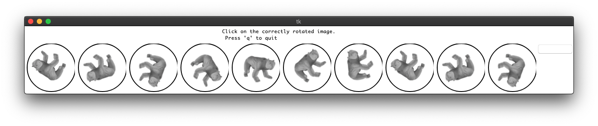

# labeller
a simple image annotation tool for correctly oriented images

Here's a little tool for manually labelling images. This program will look for images in a directory (defaulted to `data/`), and display a series of images of varying orientations.

Clicking on the correct image saves the result in `annotations.csv`, and pressing 'q' while the window is in focus exits the program.

This program keeps track of which image sets have already been annotated, i.e., there is a corresponding entry in `annotations.csv`. Each time the dataset is augmented, the program will only ask you to manually classify those.

On the far right, there is a button labelled "Bad data" (for some reason, does not render correctly on OSX). You can use that if the data is corrupted, or doesn't suit the format you desire. In this case, the program will still record an entry in the csv file, however the filename column will be blank.
